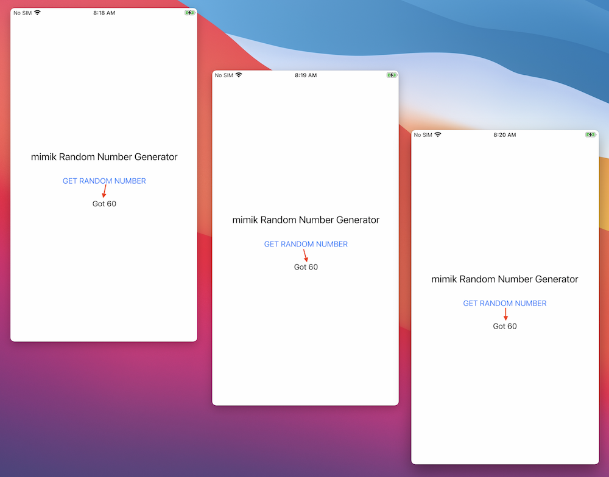
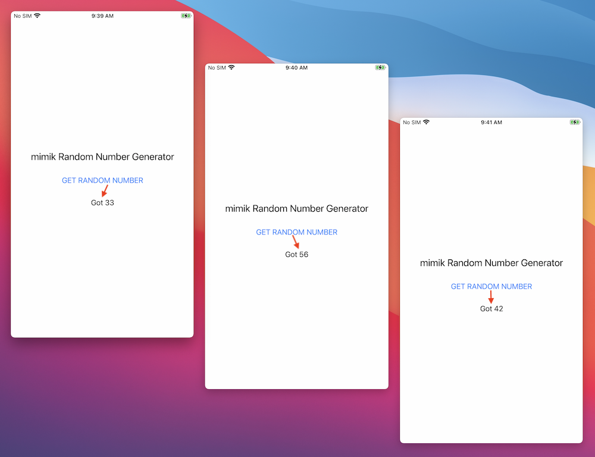

# Random Number Generator for iOS Devices
The purpose of this project is to demonstrate how to program an iOS application that generates a random number using a edge microservice that runs under the edgeEngine Runtime.

|What are the edgeEngine Runtime and edge microservices|
|----|
|The edgeEngine Runtime and edge microservices are technologies developed by mimik. mimik technology enables any computing device to act as a server, enabling all computing devices to communicate directly at the application layer according to the principles of edge computing.|

To clone the code to your local machine, execute the following command:

`git clone https://github.com/mimikgit/random-number-generator-iOS.git`

# Using the project with the edge microservice tutorial

This project is intended to be the demonstration code that accompanies the online tutorial *Creating a Simple iOS Application that Uses an edge microservice*. You can find the tutorial [here](https://devdocs.mimik.com/tutorials/08-index).

This project is structured as a scenario that shows you how to fix a bug in the code by using an edge microservice to solve the problem. The bug is that the code is supposed to generate a random number each time a button on the screen of the iOS device is tapped. But, it doesn't. The same number keeps appearing. However, this project does have code that provides a fix.

This project is divided into two branches. The `main` branch has the buggy code. The `completed_code` branch has the code that fixes the bug.

You might want to take a look at the buggy project in the `main` branch first, to see how the project is structured.

Then, if you want to see the bug free code in the `completed_code` branch go [here](https://github.com/mimikgit/random-number-generator-iOS/tree/completed_code).

If you want see the fixed code locally, checkout the `completed_code` branch using the following steps:

* `git checkout completed_code`

* cd to the project directory where the `Podfile` file is.

* `pod install --repo-update`

# Getting the code up and running

**BE ADVISED:** In order to run this code you need to have an active edge project registered at the mimik developer portal.

You can create and register an edge project at the mimik Developer Portal console [here](https://developer.mimik.com/console). **There is no charge for creating a mimik edge project. It's absolutely free!**

You'll configure the application using the various tokens generated from within a mimik Developer Console.